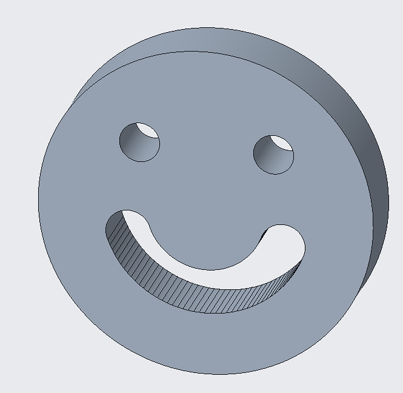

# Playground Models

A collection of practice models and experimental designs perfect for learning 3D modeling and 3D printing techniques.

## 🎯 Model Collection

### Practice Models

#### Practice 1
- **Files**: `prt0001.prt.1`
- **Views**: 
  <table>
  <tr>
  <td align="center">
  
   <b>View 1</b>
  </td>
  <td align="center">
  
   <b>View 2</b>
  </td>
  </tr>
  </table>
- **Description**: Basic geometric practice model

#### Practice 2
- **Files**: `prt0002.prt.1`
- **Views**: 
  <table>
  <tr>
  <td align="center">
  
   <b>View 1</b>
  </td>
  <td align="center">
  
   <b>View 2</b>
  </td>
  </tr>
  </table>
- **Description**: Intermediate complexity model

#### Practice 3
- **Files**: `prt0003.prt.1`
- **Views**: 
  <table>
  <tr>
  <td align="center">
  
   <b>View 1</b>
  </td>
  <td align="center">
  
   <b>View 2</b>
  </td>
  </tr>
  <tr>
  <td align="center" colspan="2">
  
   <b>View 3</b>
  </td>
  </tr>
  </table>
- **Description**: Multi-view complex model

#### Practice 4
- **Files**: `prt0004.prt.1`
- **Views**: 
  <table>
  <tr>
  <td align="center">
  
   <b>View 1</b>
  </td>
  <td align="center">
  
   <b>View 2</b>
  </td>
  </tr>
  <tr>
  <td align="center" colspan="2">
  
   <b>View 3</b>
  </td>
  </tr>
  </table>
- **Description**: Advanced practice model

#### Practice 5
- **Files**: `prt0005.prt.1`
- **Description**: Additional practice piece

### Special Models

#### Smiley Face
- **Files**: `smiley.prt.1`
- **Image**: 
  <table>
  <tr>
  <td align="center">
  
   <b>Smiley Face</b>
  </td>
  </tr>
  </table>
- **Description**: Fun smiley face model for beginners

#### Chair Design
- **Files**: `chair.prt.1` to `chair.prt.10`
- **Format**: Creo parts + IGES (`chair.igs`)
- **Views**: 
  <table>
  <tr>
  <td align="center">
  
   <b>View 1</b>
  </td>
  <td align="center">
  
   <b>Side View</b>
  </td>
  </tr>
  <tr>
  <td align="center" colspan="2">
  
   <b>Back View</b>
  </td>
  </tr>
  </table>
- **Description**: Chair design practice model

## 🎓 Learning Objectives

### Beginner Level
- **Smiley Face**: Basic shapes and features
- **Practice 1**: Simple geometric forms
- **Chair**: Basic furniture design

### Intermediate Level
- **Practice 2**: More complex geometry
- **Practice 3**: Multi-view modeling
- **Practice 4**: Advanced features

### Advanced Level
- **Practice 5**: Complex assemblies
- **Custom Designs**: Modify existing models

## 🛠️ 3D Printing Specifications

### Recommended Settings
- **Material**: PLA (easy to print, good for learning)
- **Layer Height**: 0.2mm
- **Infill**: 20-30%
- **Supports**: Minimal required

### Print Time Estimates
- **Smiley Face**: 30 minutes - 1 hour
- **Practice 1-2**: 1-2 hours
- **Practice 3-4**: 2-4 hours
- **Chair**: 4-8 hours

### Difficulty Levels
- **Easy**: Smiley face, Practice 1
- **Medium**: Practice 2, Chair
- **Hard**: Practice 3-5

## 📚 Educational Value

### CAD Skills Developed
- **Basic Modeling**: Extrude, revolve, sweep
- **Feature Creation**: Holes, fillets, chamfers
- **Assembly**: Multi-part design
- **Rendering**: Creating view images

### 3D Printing Skills
- **Orientation**: Best print orientation
- **Supports**: When and how to use
- **Scaling**: Adjusting model size
- **Post-processing**: Finishing techniques

## 🎯 Use Cases

### Educational
- CAD software learning
- 3D printing education
- Design thinking exercises
- Technical drawing practice

### Personal Projects
- Desk decorations
- Learning projects
- Gift items
- Skill building

### Professional Development
- Portfolio building
- Skill demonstration
- Interview projects
- Continuous learning

## 🔧 Customization Ideas

### Modifications
- **Scale Changes**: Make models larger or smaller
- **Color Variations**: Print in different colors
- **Feature Addition**: Add personal touches
- **Combination**: Merge different models

### Learning Projects
- **Reverse Engineering**: Analyze and recreate
- **Improvement**: Add features or fix issues
- **Documentation**: Create your own guides
- **Sharing**: Teach others with these models

## ⚠️ Printing Tips

### For Beginners
- Start with the smiley face
- Use simple settings initially
- Don't worry about perfect quality
- Focus on learning the process

### For Advanced Users
- Experiment with different materials
- Try different scales
- Combine multiple models
- Create your own variations

## 📖 Learning Resources

### CAD Software
- Creo Parametric (original software)
- Fusion 360 (free alternative)
- FreeCAD (open source)
- TinkerCAD (web-based, beginner-friendly)

### 3D Printing
- Slicer software (Cura, PrusaSlicer)
- Print settings optimization
- Troubleshooting guides
- Community forums

## 🎉 Next Steps

1. **Start Simple**: Begin with the smiley face
2. **Progress Gradually**: Work through practice models
3. **Experiment**: Try modifications
4. **Share**: Document your learning journey
5. **Create**: Design your own models

---

*These models are perfect for anyone starting their journey in 3D modeling and 3D printing. Take your time, experiment, and most importantly, have fun learning!*
